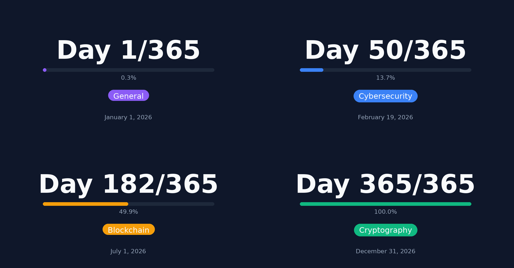

# LinkedIn 365 - Daily Post Image Generator

A Python tool to generate consistent, branded images for a 365-day LinkedIn posting challenge.



## Features

- 🎨 **Color-coded topics** - Instantly recognizable categories
- 📊 **Progress tracking** - Visual progress bar that fills throughout the year
- 📱 **Multiple aspect ratios** - Landscape (1200x627) for LinkedIn, Portrait (1080x1350) for Instagram
- 🗓️ **Smart date handling** - Automatically calculates day number from date
- 🌙 **Dark theme** - Modern, tech-focused aesthetic
- ⚙️ **Configurable** - Easy to customize colors, fonts, and layout
- 🚀 **Simple CLI** - Generate images with a single command

## Quick Start

```bash
# Install dependencies
uv sync

# Generate an image with today's date (automatically calculates day number)
uv run python generate.py general

# Or specify a date
uv run python generate.py cybersecurity --date "January 15, 2026"
```

Or without uv:

```bash
pip install -r requirements.txt
python generate.py general
```

## Usage

```bash
python generate.py <topic> [options]
```

### Arguments

| Argument | Required | Description |
|----------|----------|-------------|
| `topic` | Yes | Topic category (see below) |
| `--day` | No | Day number (1-365). If not provided, calculated from date. |
| `--date`, `-d` | No | Date to display (default: today). Used to calculate day if --day not provided. |
| `--aspect-ratio`, `-a` | No | Image aspect ratio: `landscape` (1200x627) or `portrait` (1080x1350). Default: landscape |
| `--output`, `-o` | No | Output path (default: `output/day_XXX_topic[_portrait].png`) |

### Topics

| Topic | Color | Use for |
|-------|-------|---------|
| `cybersecurity` | 🔵 Blue | Security, hacking, vulnerabilities |
| `blockchain` | 🟠 Orange | Blockchain, crypto, web3 |
| `cryptography` | 🟢 Green | Encryption, protocols, math |
| `ai` | 🔵 Cyan | Artificial intelligence, machine learning |
| `general` | 🟣 Purple | Everything else |

### Examples

```bash
# Use today's date (automatically calculates day number)
python generate.py general

# Specify a date (day number calculated automatically)
python generate.py cybersecurity --date "January 15, 2026"

# Explicit day number
python generate.py blockchain --day 100

# Generate portrait format for Instagram
python generate.py ai --aspect-ratio portrait

# Combine options
python generate.py cryptography --day 42 --date "February 11, 2026" -a portrait -o my_post.png
```

## Configuration

Edit `config.py` to customize:

- **Colors** - Background, text, accent colors for each topic
- **Dimensions** - Image size (default: 1200x627 for LinkedIn)
- **Typography** - Font paths and sizes
- **Layout** - Position of elements

### Adding a New Topic

```python
# In config.py, add to TOPICS dict:
TOPICS = {
    # ... existing topics ...
    "ai": {
        "color": "#EC4899",  # Pink
        "label": "AI & ML",
    },
}
```

### Custom Fonts

```python
# In config.py:
FONTS = {
    "bold": "/path/to/YourFont-Bold.ttf",
    "regular": "/path/to/YourFont-Regular.ttf",
    # ...
}
```

## Project Structure

```
linkedin-365/
├── generate.py      # Main script
├── config.py        # Configuration
├── pyproject.toml   # Project metadata (uv)
├── requirements.txt # Dependencies (pip fallback)
├── CLAUDE.md        # Context for Claude Code
├── samples/         # Example images
└── output/          # Generated images (gitignored)
```

## Requirements

- Python 3.8+
- [uv](https://github.com/astral-sh/uv) (recommended) or pip
- Pillow

## License

MIT - Do whatever you want with it.

---

*Part of a 365-day LinkedIn posting experiment in 2026.*
